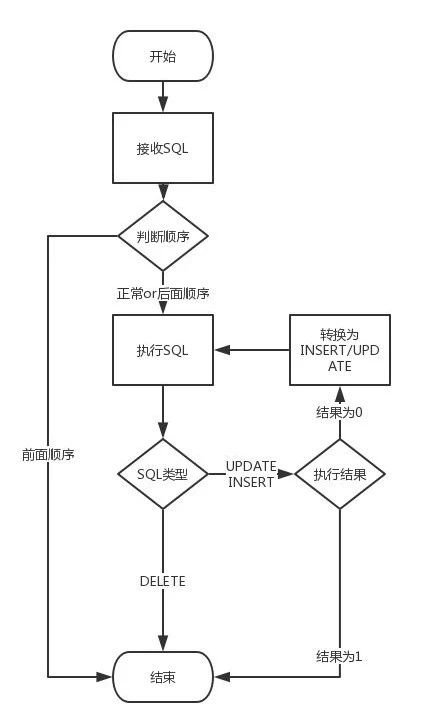

<!--
 * @Author: tangdaoyong
 * @Date: 2021-02-04 09:41:21
 * @LastEditors: tangdaoyong
 * @LastEditTime: 2021-02-04 10:11:28
 * @Description: CRDT
-->
# CRDT

[重要](https://cloud.tencent.com/developer/article/1422458)
[容灾架构](https://mp.weixin.qq.com/s/ty5GltO9M648OXSWgLe_Sg)

在理解CRDT之前，最好阅读因果一致性与[COPS](https://www.jdon.com/artichect/cops.html)。

2012年CAP理论提出者Eric Brewer撰文回顾CAP时也提到，C和A并不是完全互斥，建议大家使用CRDT来保障一致性。CRDT(Conflict-Free Replicated Data Type)是各种基础数据结构最终一致算法的理论总结，能根据一定的规则自动合并，解决冲突，达到强最终一致的效果。。通过查阅相关资料，我们了解到CRDT要求我们在数据同步的时候要满足交换律、结合律和幂等律。如果操作本身满足以上三律，merge操作仅需要对update操作进行回放即可，这种形式称为op-based CRDT，如果操作本身不满足，而通过附带额外元信息能够让操作满足以上三律，这种形式称为state-based CRDT。

通过DRC的拆解，数据库操作有三种：insert、update、delete，这三种操作不管哪两种操作都是不能满足交换律的，会产生冲突，所以我们在并发级别（主键）加上额外信息，这里我们采用序号，也就是2中提到的染色的过程，这个过程是保留的。而主键之间是并发的，没有顺序而言。当接收消息的时候我们并不保证强顺序，采用LWW（Last Write Wins）的方式，也就是说我们执行当前的SQL而放弃前面的SQL，这样我们就不用考虑交换的问题。同时我们会根据消息的唯一性（实例+单元+数据库+MD5(SQL)）对每个消息做幂等，保证每个SQL都不会重复执行。而对于结合律，我们需要对每个操作单独分析。

1）insert

insert是不满足结合律的，可能会有主键冲突，我们把insert语句变更insert ignore，而收到insert操作说明之前并不存在这样一条记录，或者前面有delete操作。而delete操作可能还没有到。这时insert ignore操作返回结果是0，但这次的insert数据可能跟已有的记录内容并不一致，所以这里我们将这个insert操作转换为update 操作再执行一次。

2）update

update操作天然满足结合律。但是这里又要考虑一种特殊情况，那就是执行结果为0。这说明此语句之前一定存在一个insert语句，但这个语句我们还没有收到。这时我们需要利用这条语句中的数据将update语句转成insert再重新执行一次。

3）delete

delete也是天然满足结合律的，而无论之前都有什么操作，只要执行就好了。

在insert和update操作里面，都有一个转换的过程，而这里有个前提，那就是从DRC拿到的变更数据每一条都是全字段的。可能有人会说这里的转换可以用replace into替换，为什么没有使用replace into呢，首先由于顺序错乱的情况毕竟是少数，而且我们并不单纯复制数据，同时也是在复制操作，而对于DRC来说，replace into操作会被解析为update或insert。这样无法保证消息唯一性，也无法做到防循环广播，所以并不推荐。我们看看下面的流程图也许会更清晰些：

 容灾架构

根据上面的介绍，我们来看下多中心容灾架构的形态，这里用了两级调度来保证中心封闭，同时利用自研的同步组件进行多中心双向同步。我们还可以制定一些快恢策略，例如快速摘掉一个中心。同时还有一些细节需要考虑，例如在摘掉一个中心的过程中，在摘掉的中心数据还没有同步到其他中心的过程中，应该禁掉写操作，防止短时间出现双写的情况，由于我们同步的时间都是毫秒级的，所以影响很小。

